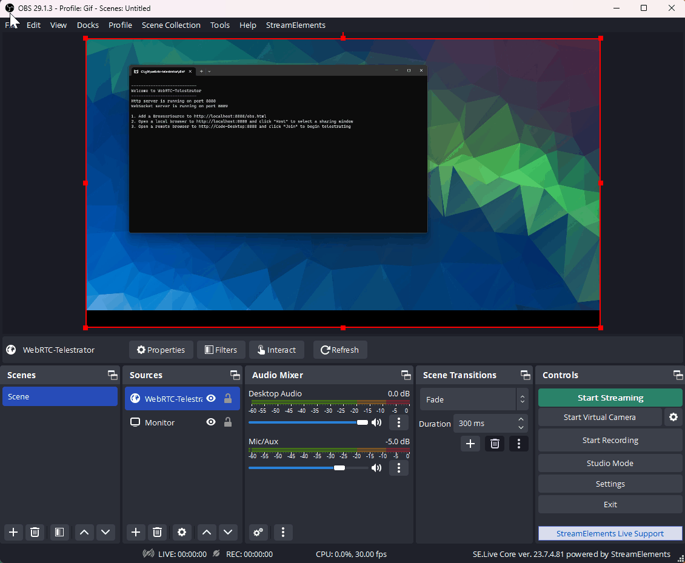

# WebRTC-Telestrator

A remote telestrator app using WebRTC. Use a remote device (such as a phone or tablet) to draw on your screen while recording/streaming via OBS. Rather than just having a blank 'greenscreen' to draw on, this app streams a specified display so that you can see exactly where you are drawing on your device.

## Example

## Usage
1. Launch webrtc-telestrator
    * This will start a small http/websocket server on port 8888 (by default).
1. In OBS, add a new Browser source and point it to http://localhost:8888/obs.html
    * This will request a transparent streaming mjpeg image from the server and display it.
    * Overlay this browser source on your OBS setup.
1. On your OBS machine, open a new WebRTC enabled web browser to http://localhost:8888
    * The built in OBS browser source doesn't support WebRTC so you need to use a real browser such as Edge or Chrome.
    * Tested with Windows Microsoft Edge.
    * Note: Be sure to use '**localhost**' and not '*yourhostmachine*' because the browser blocks WebRTC share requests on non-https (aka http) servers which this is.
1. In the browser, click "Host" and select the window/display you want to stream
    * This will be the live image that will be the background for the remote device to see where they are drawing.
    * Some suggestions:
        * Just select the monitor that you are streaming/recording.
        * In OBS, right-click a source and select "Windowed Projector (Source)" to open a new window showing just that source. Then select that window in the Host browser.
1. On your remote device, open a new WebRTC enabled web browser to http://yourhostmachine:8888
    * Your device browser will need to support WebRTC.
    * Tested with Windows (Microsoft Edge), Android (Chrome), IOS (Safari).
1. In the browser, click "Join" to begin telestrating
    * This will connect to the host and show the shared display as the background of your canvas.
    * Drawing on the canvas will send the data to the server and display it on the OBS browser source which will then be recorded/streamed as normal.
    * Happy drawing!

## Notes
* By default the http server will bind to all available network interfaces (via 0.0.0.0). 
* You can override this by specifying the `--bind <ip address>` option, but doing so will cause display sharing to stop working (due to a browser security feature preventing sharing over http unless its localhost).
* As a workaround, you can use the `--unsafely-treat-insecure-origin-as-secure` flag in chromium based browsers to re-enable sharing:
    1. Open Chrome/Edge
    1. Navigate to `chrome://flags` or `edge://flags`
    1. Search for `unsafely-treat-insecure-origin-as-secure`
    1. Enable the flag via the dropdown
    1. In the textbox enter the full url for webrtc-telestrator `http://<ip address>:<port>`
    1. Click the `Restart` browser button to apply the change

## Development Setup
* Clone this repo
* Run `npm install` in '/webrtc-telestrator'
* Open '/webrtc-telestrator' in `VS Code`
* Press `F5` to start debugging

To anyone brave enough to use this - Good Luck!

##

Want to support me staying awake long enough to add some more features?

